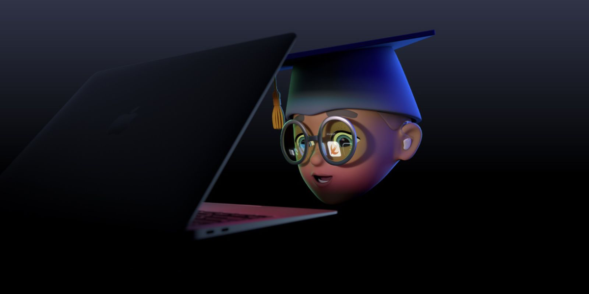

# WWDC 2021 - Swift Student Challenge

List of student submissions for the WWDC 2021 - Swift Student Challenge.

### How to add your submission?
1. [Click here](https://github.com/wwdc/2021/edit/main/Template.md) to fork this repository and edit the `Template.md` file.
2. Fill out the document based on the example in the comment below.
3. Make a new Pull Request and wait for the review.

#### How to update your submission?
If you would like to update your submission status please find your file in `Submission` directory. Edit file, update status and create Pull Request.

### Submissions

| Name | Source |    Video    | Technologies | Status |
|-----:|:------:|:-----------:|:-------------|:------:|
|[A. Alkan Caner](https://github.com/AlkanCaner)|[GitHub](https://github.com/AlkanCaner/StylizedArt)|[YouTube](https://www.youtube.com/watch?v=V2-lZlgsD1k&t=4s)|SwiftUI, CoreML||
|[Adam Zhao](https://github.com/ZXXZ00)|-|[YouTube](https://youtu.be/_wrRRgDcfdA)|Accelerate, PencilKit, UIKit||
|[Alan Yan](https://github.com/yan-alan)|[GitHub](https://github.com/yan-alan/Dance-Party)|-|Vision, AVFoundation, SwiftUI, UIKit||
|[Alperen Örence](https://github.com/alperenorence)|[GitHub](https://github.com/alperenorence/chatbots)|-|SwiftUI, Combine||
|[Alvin Hsueh](https://www.instagram.com/qazqwe0922/)|[GitHub](https://github.com/HaXAlvin/WWDC21_Hello_World)|-|SwiftUI, SpriteKit, ARKit, UIKit||
|[Anant Kanchan](https://github.com/anantcodes)|[GitHub](https://github.com/anantcodes/NaviOS)|-|SwiftUI||
|[Anav Mehta](http://3dwaffles.blogspot.com)|[GitHub](https://github.com/anavmehta/ChessRealityPlaygroundBook)|[YouTube](https://youtu.be/tLK6NKbC-NQ)|RealityKit, AVKit, RealityComposer||
|[Andrean Lay](https://github.com/andreanlay)|[GitHub](https://github.com/andreanlay/jebot-wwdc21)|-|SwiftUI, AVFoundation||
|[Andrew Glen](https://github.com/nanothread)|[GitHub](https://github.com/nanothread/Functional-Programming-With-Physics)|-|SpriteKit, SwiftUI||
|[Andrew Z](https://github.com/aheze/)|[GitHub](https://github.com/aheze/AccessibleReality)|[YouTube](https://www.youtube.com/watch?v=BH2HONBJiF0)|SwiftUI, ARKit, Vision||
|[Arjun Dureja](https://github.com/arjun-dureja)|[GitHub](https://github.com/arjun-dureja/WWDC21-Swift-Student-Challenge)|[YouTube](https://www.youtube.com/watch?v=BNntCgua848)|UIKit||
|[Atulya Weise](https://atulya.me)|[GitHub](https://github.com/atultw/physics-swift)|-|SpriteKit, SwiftUI||
|[Baran Önen](https://github.com/baranonen)|[GitHub](https://github.com/baranonen/WWDC21-Barcodes)|-|SwiftUI, SpriteKit||
|[Barbra Eliza](https://github.com/barbraeliza)|[GitHub](https://github.com/barbraeliza/WWDC2021)|[YouTube](https://www.youtube.com/watch?v=p1udeXu4F4U)|SpriteKit, AVFoundation||
|[Batuhan Karababa](https://github.com/batuhankrbb)|[GitHub](https://github.com/batuhankrbb/AppleHeroes)|[YouTube](https://www.youtube.com/watch?v=w1ceszjuaco)|SwiftUI||
|[Benjamin Hutter](https://github.com/benjaminhtr)|[GitHub](https://github.com/benjaminhtr/WWDC21)|-|SwiftUI, SpriteKit, UIKit||
|[Benji Burgess](https://twitter.com/benj_io)|[GitHub](https://github.com/benjiburgess/wwdc21)|-|SwiftUI||
|[Berkin Ceylan](https://github.com/berkinceylan)|[GitHub](https://github.com/berkinceylan/WWDC21)|-|SwiftUI, AVFoundation||
|[Bryanza Novirahman](https://github.com/bryanzanr)|[GitHub](https://github.com/bryanzanr/skipper)|[YouTube](https://youtu.be/rUaxRIN6_CE)|SwiftUI||
|[Can Balkaya](https://github.com/canbalkaya)|[GitHub](https://github.com/canbalkaya/Machine-Dreams-WWDC21)|-|ARKit, SceneKit, CoreML, SwiftUI||
|[Choyi Jeong](https://github.com/iamcho2)|[GitHub](https://github.com/iamcho2/WWDC-2021)|-|SwiftUI, SpriteKit||
|[Christian Privitelli](https://github.com/Priva28)|[GitHub](https://github.com/Priva28/Swift3D)|-|SwiftUI, SceneKit, ARKit||
|[Corentin Medina](https://twitter.com/Elfyro)|[GitHub](https://github.com/CorentiOS/WWDC2021)|[YouTube](https://www.youtube.com/watch?v=IRqJCoCRcs4)|SpriteKit, GameplayKit, AVFoundation||
|[Cristian Garske](https://www.instagram.com/oddghostly/)|[GitHub](https://github.com/CristianGarske/WWDC21)|[YouTube](https://youtu.be/26w5qdg78_s)|SwiftUI||
|[Darshil Agrawal](https://twitter.com/agrawal_darshil)|[GitHub](https://github.com/darshilagrawal/WWDC2021-Submission-Accepted-)|-|CrytpoKit,SwiftUI||
|[David Knothe](https://github.com/knothed)|[GitHub](https://github.com/knothed/Symmetries)|-|Accelerate, CoreAnimation||
|[Davin Djayadi](https://github.com/davindj)|[GitHub](https://github.com/davindj/add-modulo)|-|SpriteKit, AVFoundation||
|[Deniz Karakay](https://twitter.com/KarakayDeniz)|[GitHub](https://github.com/dkarakay/wwdc-2021-perfec0)|-|SpriteKit, AVFoundation, SwiftUI, UIKit||
|[Dhanraj Chavan](https://twitter.com/codingpotter)|[GitHub](https://github.com/dhanrajdc7/CryptoCam)|[YouTube](https://youtu.be/gMEdtcLDdGU)|UIKit, Vision, AVFoundation||
|[Djenifer R Pereira](https://github.com/djeni98)|[GitHub](https://github.com/djeni98/naipi-and-taroba)|[YouTube](https://www.youtube.com/watch?v=NP4XIpNLOc4)|SpriteKit||
|[Don Chia](https://donchia.tech)|[GitHub](https://github.com/dhs17y2adonchia/WWDC2021)|-|SwiftUI, UIKit, WKWebView||
|[Elaine Cruz](https://github.com/elainecruz)|[GitHub](https://github.com/elainecruz/WWDC21)|-|UIKit, RealityKit||
|[Erick Almeida](https://github.com/erick2280)|[GitHub](https://github.com/erick2280/dines-donkey-playground)|-|SwiftUI||
|[Federico Ciardi](https://github.com/fedeci)|[GitHub](https://github.com/fedeci/WWDC2021)|-|SceneKit, SpriteKit, AVFoundation, Combine||
|[Filip Kania](https://github.com/filipkania)|[GitHub](https://github.com/filipkania/getout.)|-|SceneKit, AVFoundation, AppKit||
|[Fred P](https://github.com/fredpi)|[GitHub](https://github.com/fredpi/WWDC2021)|-|UIKit, Core Animation, Core Graphics||
|[Frederico Lacis](https://github.com/fredlacis)|[GitHub](https://github.com/fredlacis/GeneticAlgorithms_WWDC21)|[YouTube](https://www.youtube.com/watch?v=-wLLsycY_cs)|SwiftUI||
|[Furkan Hancı](https://github.com/Furkanus)|[GitHub](https://github.com/Furkanus/BioShine)|-|SwiftUI||
|[Gabriel Muelas](https://github.com/MuelasU)|[GitHub](https://github.com/MuelasU/wwdc21-float-or-sink)|[YouTube](https://youtu.be/fin79NjjNHw)|SwiftUI||
|[Garima Bothra](https://github.com/garima94921)|[GitHub](https://github.com/garima94921/DoubleSpending-WWDC21)|-|CryptoKit, SwiftUI||
|[Garv Shah](https://github.com/garv-shah)|[GitHub](https://github.com/garv-shah/WWDC21-Galton-Board)|-|SpriteKit, UIKit||
|[Gokul R Nair](https://github.com/gokulnair2001)|[GitHub](https://github.com/gokulnair2001/WWDC_SSC_2021)|-|UIKit||
|[Gustavo Tatarem](https://github.com/gustatarem)|[GitHub](https://github.com/gustatarem/choose-your-car)|[YouTube](https://youtu.be/QINtUIOSEDc)|SpriteKit, AVFoundation||
|[Haobo Xu](https://haoboxuxu.github.io)|[GitHub](https://github.com/haoboxuxu/WWDC2021-TheHackOfRayTracing)|[YouTube](https://youtu.be/LqT7yQC8kk4)|MetalKit, Ray-Tracing algorithms||
|[Haotian Zheng](https://fincher.im/)|[GitHub](https://github.com/JustinFincher/WWDC2021ScholarshipProject)|[YouTube](https://www.youtube.com/watch?v=AT6XDYx_aRg)|ARKit, SceneKit, MetalKit, SwiftUI||
|[Henri  Bredt](https://github.com/henribredt)|[GitHub](https://github.com/henribredt/UserExperience-WWDC21)|-|SwiftUI||
|[Hugo Lispector](https://hugolispector.com)|-|[YouTube](https://youtu.be/Vm2tvazcDwU)|SpriteKit||
|[Ibrahim Berat Kaya](https://github.com/iberatkaya)|[GitHub](https://github.com/iberatkaya/wwdc21)|[YouTube](https://www.youtube.com/watch?v=AhJjLU_ENXs)|SwiftUI||
|[Ishan Chhabra](https://github.com/ishan-chhabra)|[GitHub](https://github.com/ishan-chhabra/spacewalk)|[YouTube](https://www.youtube.com/watch?v=lOLcMdaWx5s)|AVFoundation, SpriteKit||
|[Izabella Melo](https://github.com/izmcm)|[GitHub](https://github.com/izmcm/WhatIsSQLi)|-|SwiftUI||
|[Jakub Florek](https://github.com/MAJKFL)|[GitHub](https://github.com/MAJKFL/Wonderful_Icons-WWDC21)|[YouTube](https://youtu.be/6VkkqBUv13s)|SwiftUI, UIKit, Combine, AVFoundation||
|[Jan Luca Siewert](https://jl-siewert.de/about)|[GitHub](https://github.com/jlsiewert/SwiftAR)|[YouTube](https://youtu.be/3GeFRthFBs8)|ARKit, SceneKit, SwiftUI||
|[Javier Gallo Roca](https://twitter.com/Happygallo)|[GitHub](https://github.com/Happygallo/LangtonsAnt.git)|[YouTube](https://youtu.be/gCRG00CTZCo)|SpriteKIt, SwiftUI||
|[Jia Chen](https://github.com/jiachenyee)|[GitHub](https://github.com/jiachenyee/wwdc21explorer)|-|SceneKit, UIKit, SwiftUI, Natural Language||
|[Jimmy Tan](https://www.linkedin.com/chatin/wnc/in/jianhui-jimmy-tan-6b2595175)|[GitHub](https://github.com/JimmyTan823/wwdc)|[YouTube](https://www.youtube.com/watch?v=hwe_fkz52fs)|SwiftUI, AVFoundation||
|[Joe Naveau](https://twitter.com/joenaveau)|-|[YouTube](https://www.youtube.com/watch?v=3pef6mkJGJc&list=PLZw7eGQJuMjlFtuO2dc1DazkhwaOIgfSo&index=36&t=1s)|SpriteKit, AVFoundation||
|[Jose Adolfo Talactac](https://twitter.com/devjoseadolfo)|[GitHub](https://github.com/devjoseadolfo/CircuitPlay)|[YouTube](https://youtu.be/pm3mlDZJSes)|SwiftUI, Accelerate, RealityKit, ARKit||
|[João Carlos Magalhães](https://www.youtube.com/channel/UCDNFUQY2XT44NXXZj7-oG-g)|[GitHub](https://github.com/joaocarlos-mag/WWDC-2021-Scholarship-Submission)|-|UIKit, SpriteKit, SceneKit, Accelerate||
|[João Gabriel](https://twitter.com/joogps)|[GitHub](https://github.com/joogps/WWDC-2021)|-|SwiftUI, AVFoundation||
|[Julian Benedikt Heuschen](https://twitter.com/HeuschenJ)|[GitHub](https://github.com/jbheuschen/Cryptography)|-|SwiftUI, Security, CryptoKit, CommonCrypto||
|[Julian Schiavo](https://twitter.com/_julianschiavo)|[GitHub](https://github.com/julianschiavo/wwdc/)|-|AVFoundation, CoreML, SwiftUI, Vision||
|[Juliano Vaz](https://www.github.com/julianoctvaz/)|[GitHub](https://www.github.com/julianoctvaz/jardimHarmonico)|-|UIKit, AVFoundation||
|[Jun (June) Murakami](https://github.com/juneforceone)|[GitHub](https://github.com/juneforceone/iRecognizer)|[YouTube](https://youtu.be/9_jidssBG9c)|SwiftUI, CoreML, ARKit||
|[Junaid Abdurahman](https://twitter.com/junaidxabd)|-|[YouTube](https://youtu.be/GUCHvjWpotY)|UIKit, CoreML, QuartzCore||
|[Kee Meng](https://github.com/KeeMeng)|[GitHub](https://github.com/KeeMeng/swift-kaleidoscope)|-|UIKit||
|[Kenneth Chew](https://github.com/kthchew)|[GitHub](https://github.com/kthchew/wwdc21-combustion)|-|SpriteKit, SwiftUI||
|[Krish Jain](https://github.com/Krish-sysadmin)|[GitHub](https://github.com/Krish-sysadmin/WWDC2021)|-|UIKit, SpriteKit||
|[Kunal Bagaria](https://twitter.com/kb24x7)|[GitHub](https://github.com/kb24x7/wwdc-2021)|-|AVFoundation, SwiftUI||
|[Lambo Zhuang](https://github.com/Lambozhuang)|[GitHub](https://github.com/Lambozhuang/Playground_CameraSimulator)|-|UIKit||
|[Lee Jaeho](https://github.com/jaeho0718)|[GitHub](https://github.com/jaeho0718/WWDC2021_Student_Challenge)|-|SpriteKit, UIKit, PlaygroundBook||
|[Leon Zhao](https://github.com/Confucius52)|[GitHub](https://github.com/Confucius52/WWDC2021_submission)|-|UIKit||
|[Liam Rosenfeld](https://twitter.com/liamrosenfeld)|[GitHub](https://github.com/liamrosenfeld/SeamCarving)|-|Metal, CoreGraphics, Accelerate, SwiftUI||
|[Lucas Wang](https://github.com/Lucas-ZX-W)|[GitHub](https://github.com/Lucas-ZX-W/apple_silicon_history)|-|UIKit, AVFoundation, AVSpeechSynthesizer||
|[Luis Genesius](https://github.com/lgenesius)|[GitHub](https://github.com/lgenesius/unity-in-diversity-wwdc21)|-|UIKit, AVFoundation, AVSpeechSynthesizer||
|[M. Bertan Tarakçıoğlu](https://medium.com/@bertan.tarakcioglu)|[GitHub](https://github.com/BertanT/The-ADHD-Exploration-WWDC21)|-|SwiftUI, Combine, PhotosUI||
|[Maiara Martins](https://github.com/MaiaraM)|[GitHub](https://github.com/MaiaraM/WWDC21-Ballet)|[YouTube](https://youtu.be/tkAKTPRCCf8)|SpriteKit, AVSpeechUtterance, AVSpeechSynthesizer, AVPlayer, UIKit||
|[Makwan Barzan](https://twitter.com/makwanbk)|[GitHub](https://github.com/m1bki0n/Kazhe)|-|SwiftUI, AVFoundation||
|[Maria Fernanda Azolin](https://github.com/azolinmf)|[GitHub](https://github.com/azolinmf/wwdc21-mixedFeelings)|[YouTube](https://www.youtube.com/watch?v=KZIUHNLthZg)|SpriteKit, UIKit||
|[Mason Dierkes](https://www.linkedin.com/in/mason-dierkes/)|[GitHub](https://github.com/mjdierkes/SkinCancers)|[YouTube](https://youtu.be/jaWeCtgJg_8)|SwiftUI||
|[Mateus Levi Fernandes](https://github.com/mateuslevisf)|[GitHub](https://github.com/mateuslevisf/wwdc21-compgraphics101)|-|SpriteKit||
|[Matheus Andrade](https://github.com/matheusvtna)|[GitHub](https://github.com/matheusvtna/Mixed-Juice)|-|SwiftUI, AVKit||
|[Matheus Gois](https://github.com/MaatheusGois)|-|[YouTube](https://youtu.be/_-NE_9EmK7c)|UIKit, SpriteKit||
|[Matheus Homrich](https://github.com/matheushomrich)|[GitHub](https://github.com/matheushomrich/GoodMorningSwiftyWWDC2021)|-|SwiftUI||
|[Matheus S. Moreira](https://github.com/matheussmoreira)|[GitHub](https://github.com/matheussmoreira/Squance)|-|SwiftUI||
|[Maxime Madrau](https://github.com/Maxmad68)|[GitHub](https://github.com/Maxmad68/Lightning-Simulator)|-|SpriteKit||
|[Mehdi Hussain](https://github.com/mehdihdev)|[GitHub](https://github.com/mehdihdev/WWDC2021)|[YouTube](https://youtu.be/T32k8JW4J0g)|UIKit, SpriteKit, SceneKit||
|[Mrinal Tyagi](https://github.com/MrinalTyagi)|[GitHub](https://github.com/MrinalTyagi/WWDC-2021-Swift-Challenge-Submission)|-|UIKit||
|[Murilo Gonçalves](https://github.com/murilo-goncalves)|[GitHub](https://github.com/murilo-goncalves/WWDC2021-VSSS)|-|SpriteKit||
|[Nathaniel Fargo](https://paradox42.tech)|[GitHub](https://github.com/theParadox42/Relativity)|-|SpriteKit, SceneKit||
|[Nguyen (Zoey) Vu](https://github.com/ThanhNguyenVu)|[GitHub](https://github.com/ThanhNguyenVu/Meal-WWDC21)|-|SwiftUI, AVFoundation||
|[Niall Kehoe](https://twitter.com/Niall_Kehoe)|[GitHub](https://github.com/niallkehoe/GreatMinds)|[YouTube](https://www.youtube.com/watch?v=_m4rY34BQbM)|SwiftUI, ARKit, RealityKit, SpriteKit||
|[Niklas Bülow](https://twitter.com/NiklasBuelow)|[GitHub](https://github.com/insightmind/WWDC21SwiftStudentChallenge)|-|SpriteKit, UIKit, AVFoundation||
|[Omar Abusharar](http://github.com/omartheturtle)|-|[YouTube](https://youtu.be/fo5AtVe_PJk)|SwiftUI||
|[Oscar Fridh](https://www.linkedin.com/in/oscar-fridh-03279b125/)|[GitHub](https://github.com/OscarFridh/SwiftSearch)|-|SpriteKit||
|[Oscar Gorog](https://github.com/OscarGorog)|[GitHub](https://github.com/OscarGorog/WWDC21-Playground)|-|SwiftUI, Combine, RealityKit, AVFoundation||
|Ozan Mirza|[GitHub](https://github.com/ozanm/WWDC-2021-Neural-Networks)|-|UIKit, CoreGraphics, Accelerate||
|[Peter Yaacoub](https://github.com/Yaacoub)|[GitHub](https://github.com/Yaacoub/Swift-Student-Challenge/tree/master/WWDC%202021)|[YouTube](https://youtu.be/pjSYAEYOPhk)|AVFoundation, CoreMotion, SpriteKit, UIKit||
|[Prajwal Kulkarni](https://twitter.com/prajwalinbizz)|[GitHub](https://github.com/prajwalkulkarni/WWDC21)|[YouTube](https://youtu.be/GgATVEkmmKI)|AVFoundation, SpriteKit, SwiftUI, UIKit||
|[Riccardo Persello](https://github.com/persello)|[GitHub](https://github.com/persello/ssc21)|-|Accelerate||
|[Richard Qi Zhi](https://twitter.com/riccqi)|[GitHub](https://github.com/riccqi/Encryption-Book)|-|CryptoKit, SpriteKit, SwiftUI||
|[Riku Arakawa](https://github.com/rikulh)|[GitHub](https://github.com/rikulh/Ohajiki)|-|SwiftUI, SpriteKit||
|[Rodrigo Matos](https://github.com/Rudigus)|[GitHub](https://github.com/Rudigus/shaderland)|-|SceneKit, SpriteKit, UIKit||
|[Roy Rao](https://github.com/RoyRao2333)|[GitHub](https://github.com/RoyRao2333/WWDC21-Apple-Scholarship)|-|Cocoa, SwiftUI, Combine, AVKit||
|[Ryan Du](https://github.com/ryendu)|[GitHub](https://github.com/ryendu/exploring-ml)|[YouTube](https://youtu.be/K9yRi89Ub5U)|SwiftUI, SpriteKit||
|[Ryan Rudes](https://github.com/Ryan-Rudes)|[GitHub](https://github.com/Ryan-Rudes/wwdc21)|[YouTube](https://www.youtube.com/watch?v=sLm7Xin9u0g)|SwiftUI, AVFoundation||
|[Sabesh Bharathi](https://github.com/programVeins)|[GitHub](https://github.com/programVeins/rubysdilemma)|[YouTube](https://www.youtube.com/watch?v=6KlwMRYOupk)|SwiftUI, AVFoundation, RealityKit, ARKit||
|[Sai Ranga Reddy](https://github.com/irangareddy)|[GitHub](https://github.com/irangareddy/Carbon-Footprint)|[YouTube](https://youtu.be/4uh_Aet8dMM)|SwiftUI, AVKit, SceneKit||
|[Sascha Salles](https://github.com/saschasalles)|[GitHub](https://github.com/saschasalles/WWDC2021)|-|ARKit, SceneKit, AVFoundation, SwiftUI||
|[Seunghun Yang](https://github.com/Yabby1997)|[GitHub](https://github.com/Yabby1997/WWDC21-Swift-Student-Challenge)|[YouTube](https://youtu.be/HVTCB2lDpjg)|SpriteKit, AVFoundation||
|[Shaun Ku](https://github.com/Grotion)|[GitHub](https://github.com/Grotion/2021WWDC_Swift-Student-Challenge_Time-Flies)|[YouTube](https://youtu.be/k0bBiF7P3lc)|SwiftUI, AVFoundation||
|[Shengjiu Shi](https://github.com/John-ssj)|[GitHub](https://github.com/John-ssj/WWDC2021)|-|UIKit, SpriteKit||
|[Shengyuan Lu](https://www.linkedin.com/in/shengyuan-lu)|-|[YouTube](https://youtu.be/dY1R0TIHwjY)|SwiftUI, ARKit, SceneKit, CoreMotion||
|[Stephen Fang](https://github.com/iamStephenFang)|[GitHub](https://github.com/iamStephenFang/KnowledgeGraph)|-|SwiftUI, AVKit||
|[Stvya Sharma](http://stvya.com)|[GitHub](https://github.com/StvyaSharma/Mini_Games)|-|UIKit, SpriteKit, AVFoundation, SwiftUI||
|[Subhronil Saha](https://github.com/subhronilsaha)|[GitHub](https://github.com/subhronilsaha/wwdc-21-submission)|[YouTube](https://www.youtube.com/watch?v=uFCORfnsnzw)|SwiftUI, AVKit||
|[Swapnanil Dhol](https://github.com/SwapnanilDhol)|[GitHub](https://github.com/SwapnanilDhol/Inclusivity)|[YouTube](https://www.youtube.com/watch?v=ELeCD3yY7uU)|Vision, SwiftUI, AVKit||
|[Sylvain Guillier](https://github.com/ElChoquito)|-|[YouTube](https://www.youtube.com/watch?v=MqWFkvcpAMk)|Vision, SwiftUI, AVFoundation||
|[Tamerlan Satualdypov](https://github.com/onl1ner)|[GitHub](https://github.com/onl1ner/Hands)|-|UIKit, AVFoundation, Vision||
|[Tejas Mehta](https://github.com/tmthecoder)|[GitHub](https://github.com/tmthecoder/MultiCalcPlayground)|-|Vision, PencilKit, CoreGraphics, UIKit||
|[Theo Caldas](https://github.com/TheoCaldas)|[GitHub](https://github.com/TheoCaldas/BoweBetterTalk-WWDC21)|[YouTube](https://youtu.be/7Y4D_xJ7EwU)|SpriteKit, AVFoundation, CoreMotion||
|[Thiago Nitschke Simões](https://github.com/thnitschke/)|[GitHub](https://github.com/thnitschke/WWDC21)|-|SwiftUI, NaturalLanguage||
|[Ufuk Köşker](https://github.com/ufukkosker)|[GitHub](https://github.com/ufukkosker/LineTicTacToe)|[YouTube](https://youtu.be/dYNNTnfAdK4)|SwiftUI, CoreMotion, CoreAnimation||
|[Varun Bhoir](https://github.com/varunBhoir)|[GitHub](https://github.com/varunBhoir/SwiftStudentChallenge2021-CoHealthAwareness)|[YouTube](https://www.youtube.com/watch?v=qaoJAVnAlFU)|SwiftUI, Combine||
|[Victor Duarte](https://www.wwdcscholars.com/s/60EDB2C6-E766-4CB0-BAFF-9087B355E770)|[GitHub](https://github.com/vixtord/amazonia-wwdc21-playground)|[YouTube](https://www.youtube.com/watch?v=J8GnzilWF_g)|SwiftUI, UIKit, AVFoundation, AVKit||
|[Viggo Overes](https://twitter.com/viggooveres)|[GitHub](https://github.com/vxvrs/wwdc21-CellularAutomaton)|-|UIKit||
|[Vitor Grechi Kuninari](https://www.wwdcscholars.com/s/32CD09B0-46A3-4D89-A10F-AF9984766715)|[GitHub](https://github.com/VitorGK/WWDC21-Swift-Student-Challenge)|-|UIKit, SpriteKit||
|[Wenqing Ge](https://github.com/XiaoGeNintendo)|[GitHub](https://github.com/XiaoGeNintendo/MIST)|-|SwiftUI, SpriteKit||
|[Wenzheng "William" Du](https://insightfulaiapps.com)|[GitHub](https://github.com/InsightfulAI/recyclingrace)|[YouTube](https://youtu.be/5TcIQGhZ8oc)|CoreML, Vision, AVFoundation, UIKit||
|[William Taylor](https://twitter.com/wfltaylor)|-|[YouTube](https://youtu.be/G6KYe352l7I)|SceneKit, UIKit, ARKit, SwiftUI||
|[Xinyi Xiang](https://github.com/xinyixiang)|[GitHub](https://github.com/xinyixiang/Rubikat)|-|SwiftUI, Foundation,Combine||
|[Ya Zou](https://github.com/ZouYa99)|[GitHub](https://github.com/ZouYa99/PitchBlock)|[YouTube](https://youtu.be/15ncJPaBK2M)|Accelerate, UIKit, SpriteKit, AVFoundation||
|[Yauheni Stsefankou](https://www.instagram.com/stefjen07)|[GitHub](https://github.com/stefjen07/WWDC21-4DVisualization)|-|SceneKit||
|[Yihan Huang](https://ethanwong.me)|[GitHub](https://github.com/GetToSet/UnicodeTour)|-|SwiftUI, SceneKit, CoreData, CoreText||
|[Yugantar Jain](https://twitter.com/yugantar8)|[GitHub](https://github.com/yugantarjain/wwdc21)|-|SwiftUI, SpriteKit, AVFoundation||
|[Yuma Soerianto](http://madebyyuma.com)|-|[YouTube](https://www.youtube.com/watch?v=Hyd1orSpdxA)|ARKit, SceneKit, SwiftUI, UIKit, CoreML||
|[Yusuf Berk Çekic](https://yusufberkcekic.com)|[GitHub](https://github.com/YuBeCe/Free-Yourself)|[YouTube](https://www.youtube.com/watch?v=lX_FfeCJBX8)|SwiftUI, SpriteKit||
|[Zachary Lineman](https://actuallyzach.com)|-|[YouTube](https://www.youtube.com/watch?v=qPPdZWZiEEY)|SwiftUI, UIKit, Genetic Algorithms||
|[Zhiyu Zhu](https://github.com/ApolloZhu)|[GitHub](https://github.com/ApolloZhu/HearSee)|-|ARKit, RealityKit, SwiftUI, AVFoundation||
|[Zijian Zhao](https://github.com/JackZhao98)|[GitHub](https://github.com/JackZhao98/WWDC21)|[Video](https://b23.tv/vwZ9PM)|SwiftUI||
|[Derek Hsieh]|[GitHub](https://github.com/DerekHsiehDev/WWDC-2021.git)|-|AVFoundation, Natural Language, SwiftUI, CoreML, CreateML, AVSpeechSynthesizer||
|[Íris Soares](https://github.com/irixs)|[GitHub](https://github.com/irixs/irix-playground)|[YouTube](https://www.youtube.com/watch?v=rDYsMPE_YUs)|SwiftUI||

##### Total: 141 | Accepted: 99
